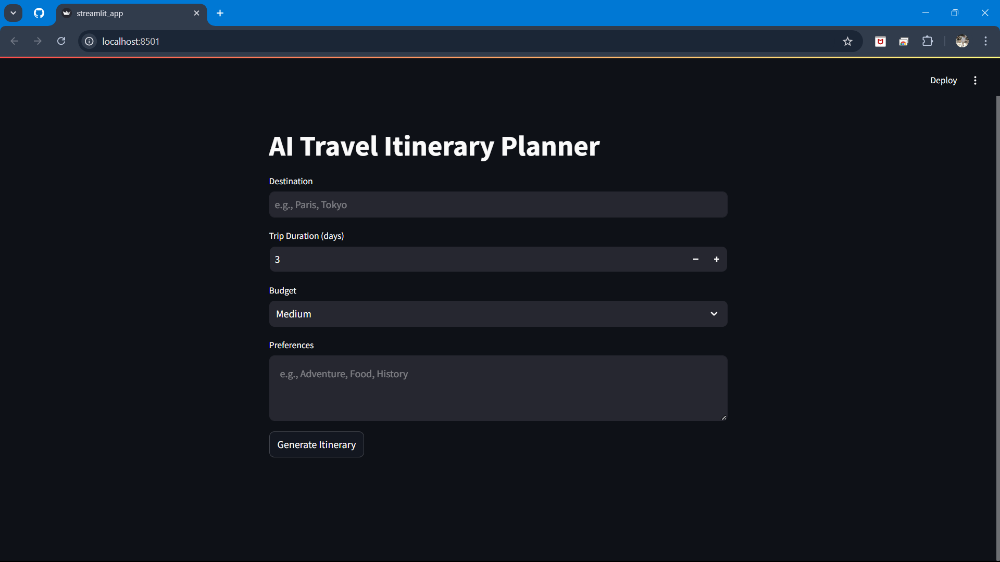
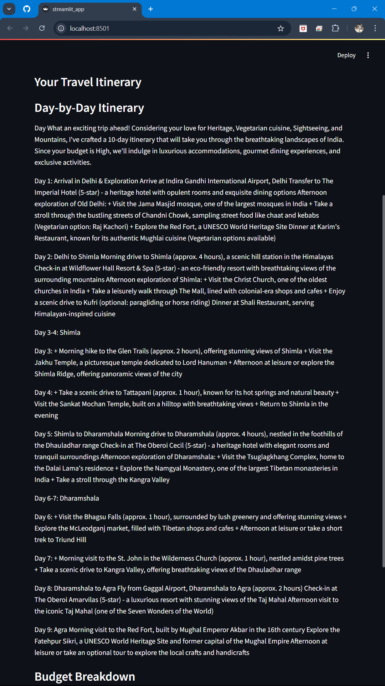
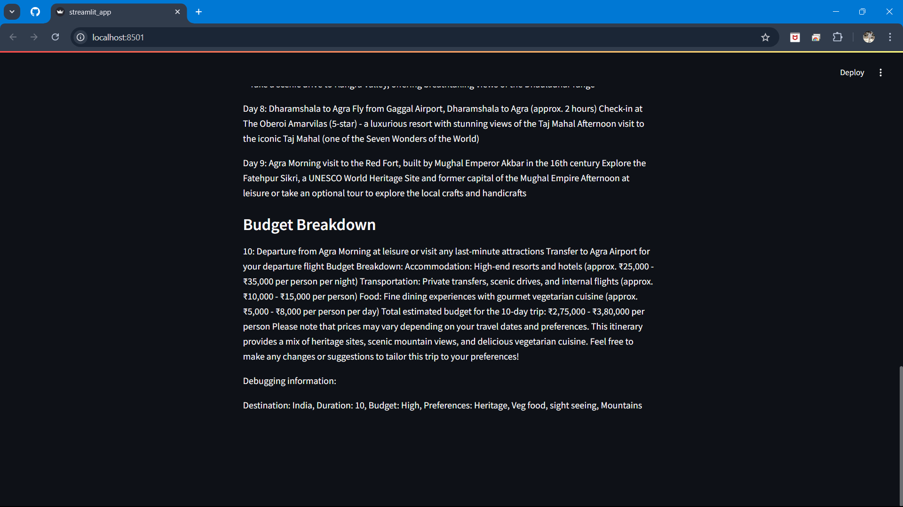

Here’s a polished and appealing `README.md` for your project:

---

# 🌍 AI Travel Itinerary Planner

**AI Travel Itinerary Planner** is a powerful and interactive web application that generates highly personalized, day-by-day travel itineraries based on user inputs such as destination, duration, budget, and preferences. Built using **Streamlit**, this application leverages **LLaMA 3.1** (via **LangChain**) for creating custom itineraries, ensuring a seamless travel planning experience.

---

## 🚀 Features

### ✅ **Personalized Itineraries**
- Generate tailored, day-by-day travel plans for any destination.
- Adapt itineraries to your preferences, including adventure, food, culture, and more.

### ✅ **Budget-Friendly Suggestions**
- Receive recommendations aligned with your budget (Low, Medium, or High).

### ✅ **Real-Time Insights**
- View the generated itineraries immediately with streamlined responses.

### ✅ **Clean and Modern UI**
- User-friendly input fields for destination, duration, budget, and preferences.
- Clear and structured display of travel plans.

---

## 🛠️ Technologies Used

### Backend
- **[LangChain](https://github.com/hwchase17/langchain):** Framework for LLM-based workflows.
- **[LLaMA 3.1](https://ollama.com):** Advanced language model for personalized response generation.
- **Python Libraries:** `streamlit`, `langchain-ollama`, `pytest`, `asyncio`.

### Frontend
- **Streamlit:** Lightweight and interactive frontend framework for building web apps.

### Utilities
- **Post-Processing:** Clean and structure the raw output for a polished presentation.

---

## 🖼️ Screenshots

### Main Page


### Generated Itinerary




---

## 🖥️ Local Development and Setup

### Prerequisites
- Python 3.8 or later.
- Install the required dependencies from `requirements.txt`.

### Installation

1. Clone the repository:
   ```bash
   git clone https://github.com/yourusername/ai-travel-itinerary-planner.git
   cd ai-travel-itinerary-planner
   ```

2. Set up a virtual environment:
   ```bash
   python -m venv venv
   source venv/bin/activate    # On Windows: venv\Scripts\activate
   ```

3. Install dependencies:
   ```bash
   pip install -r requirements.txt
   ```

4. Run the app:
   ```bash
   streamlit run streamlit_app.py
   ```

5. Access the app in your browser at `http://localhost:8501`.

---

## 🔍 Project Structure

```
.
├── app/
│   ├── itinerary.py        # Logic for generating travel itineraries
│   ├── llama_api.py        # Integration with LLaMA 3.1 model
│   ├── prompts.py          # Prompt templates for the model
│   ├── utils.py            # Utility functions (validation, response formatting)
│   ├── settings.py         # App configuration settings
├── tests/
│   ├── test_itinerary.py   # Unit tests for the itinerary logic
│   ├── test_llama_api.py   # Unit tests for LLaMA integration
│   ├── test_prompts.py     # Unit tests for prompt templates
├── streamlit_app.py        # Main Streamlit app
├── requirements.txt        # Python dependencies
└── README.md               # Project documentation
```

---

## 🧪 Testing

1. Run tests using `pytest`:
   ```bash
   pytest
   ```

2. Check coverage reports to ensure robustness:
   ```bash
   pytest --cov=app
   ```

---

## 💡 Future Enhancements
- **Multilingual Support:** Generate itineraries in various languages.
- **Offline Mode:** Enable edge-device capabilities using Retrieval-Augmented Generation (RAG).
- **Integration:** Add APIs for real-time weather updates, live transportation data, and currency conversions.

---

## 👨‍💻 Contributing
Contributions are welcome! Feel free to fork the repository and submit a pull request.

---

## 📞 Contact
- **Author:** [Aditya Arya](https://github.com/Adityarya11)
- **Email:** arya050411@gmail.com

Happy traveling! ✈️
